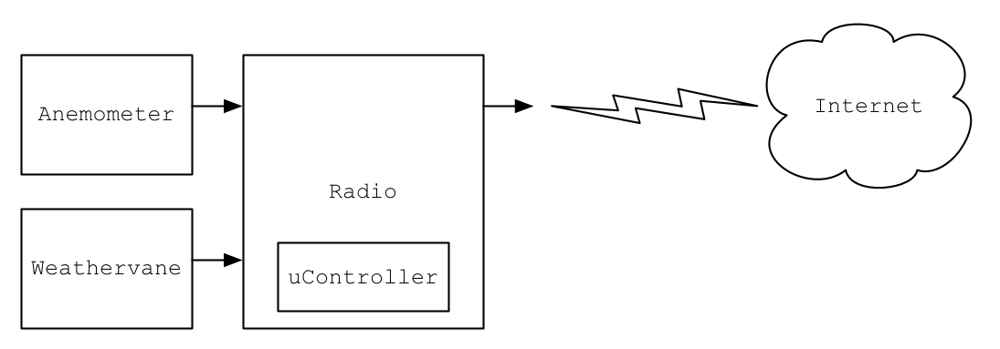

Digital Weather Station Project
===============================

This project is for an open design internet-capable weather station.

Requirements
============

1. IOT
2. Inexpensive
3. Record Wind Speed
4. Record Wind Direction

System Design
=============

This image captures a block-level design of the system.  Components are described in detail in their own markdown documents

[Anemometer](anemometer.md)

[Weathervane](weathervane.md)

[Radio](radio.md)

