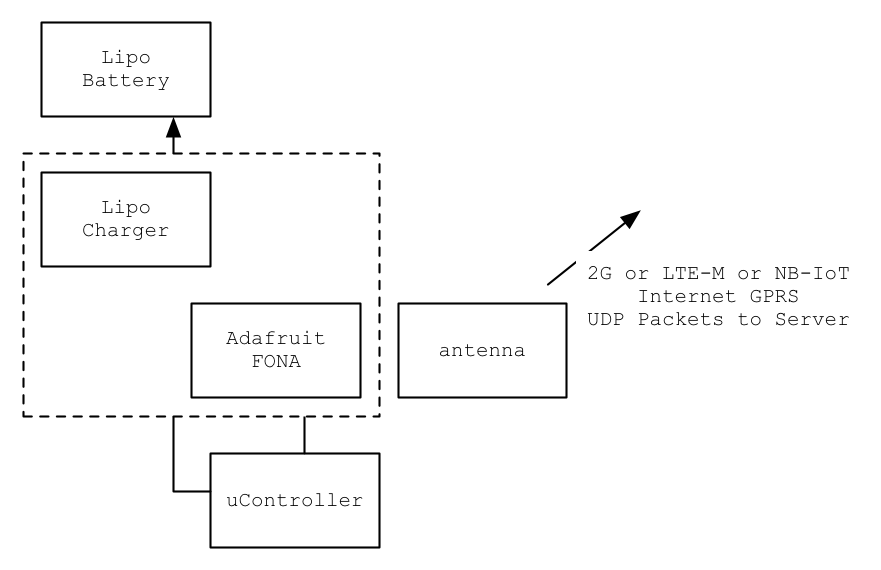

# Radio

The Radio module supports the following requirements:

- Shall support internet connectivity
- Shall be low power consumption
- Shall have a microcontroller or provide good microcontroller interface

# Design

# Battery

| Description | Role | Cost | Source | URL |
| ----------- | ---- | ---- | ------ | --- |
|Lithium Ion Polymer Battery - 3.7v 1200mAh |Battery|9.95|Adafruit|https://www.adafruit.com/product/258|

# uController options

## Adafruit FONA w/ option MicroPython PyBoard

Believed to be a good balance of cost and rapid development

| Description | Role | Cost | Source | URL |
| ----------- | ---- | ---- | ------ | --- |
|Adafruit FONA - Mini Cellular GSM Breakout - SMA Version - v1|Radio|44.95|Adafruit|https://www.adafruit.com/product/1963|
|Mini GSM/Cellular Quad-Band Antenna - 2dBi SMA Plug|Radio|4.95|Adafruit|https://www.adafruit.com/product/1859|
|MicroPython pyboard - v1.1|uC|29.95|Adafruit|https://www.adafruit.com/product/3497|

**Cost of Implementation** $79.85

## Adafruit FONA w/ option STM32 ARM Cortex M3 

Lowest cost implementation seen here with sub $8 board STM32-discovery.  Also the most complex software dev environment (C)

| Description | Role | Cost | Source | URL |
| ----------- | ---- | ---- | ------ | --- |
|Adafruit FONA - Mini Cellular GSM Breakout - SMA Version - v1|Radio|44.95|Adafruit|https://www.adafruit.com/product/1963|
|KIT DISCOVERY STM32 L1 SERIES|uC|7.88|Digikey| [URL](https://www.digikey.com/product-detail/en/stmicroelectronics/STM32L100C-DISCO/497-13930-ND/4357642) |
|Mini GSM/Cellular Quad-Band Antenna - 2dBi SMA Plug|Radio|4.95|Adafruit| [URL](https://www.adafruit.com/product/1859) |
|Adafruit Micro Lipo w/MicroUSB Jack - USB LiIon/LiPoly charger - v1|Radio|6.95|Adafruit| [URL](https://www.adafruit.com/product/1904) |
|Segger|Development||Digikey|||

**Cost of Implementation** $64.73

## Pycom gPy

Compelling SoC supports micropython and WiFi, BLE and cellular LTE CAT M1/NB1 radio protocols.

Requires additional charger circuit and antenna

| Description | Role | Cost | Source | URL |
| ----------- | ---- | ---- | ------ | --- |
|PyCom gPY module Soc  | uC    | 54.95 | Adafruit | [URL](https://www.adafruit.com/product/3612?gclid=EAIaIQobChMIj5WGopu22wIVgblkCh0dJw_5EAQYAiABEgJ1DfD_BwE) |
|pycom antenna         | Radio | 11.95 | Adafruit | [URL](https://www.adafruit.com/product/3623) | 
|Adafruit Micro Lipo w/MicroUSB Jack - USB LiIon/LiPoly charger - v1 | Radio | 6.95 | Adafruit | [URL](https://www.adafruit.com/product/1904) |

**Cost of Implementation** $73.85

# Commercially Available Systems (Cost Analysis)

| Product Name                | Cost  | Recurring Cost |
|-----------------------------|-------|----------------|
| Adafruit Feather 32u4 FONA  | 44.95 | 		|
| Particle Electron           | 69.00 | 2.99 1MB of messages |
| Hologram Dash               | 59.00 | 1MB free/month |
| GPRS Shield                 | 59.00 |  -  |

[Hologram](https://hologram.io)

[Adafruit FONA - Mini Cellular GSM Breakout - SMA Version - v1](https://www.adafruit.com/product/1963)

[Particle Electron](https://www.particle.io)

[GPRS Shield](https://www.seeedstudio.com/GPRS-Shield-V2.0-p-1379.html)

References
==========

[Google search for Cellular radio module stm32](https://www.google.com/search?client=safari&rls=en&q=cellular+radio+module+stm32&ie=UTF-8&oe=UTF-8)

[Micro Python pyboard overview](https://www.youtube.com/watch?v=WI-nTf5iM84)
[Quick reference for the pyboard ]( http://docs.micropython.org/en/latest/pyboard/pyboard/quickref.html )
[PYBLITEv1.0 Image ](http://micropython.org/resources/pyblitev10-pinout.jpg )
[T-Mobile 2G Coverage Map](https://orion.freeus.com/coverage-map.aspx )
[SIM7000 LTE CAT-M1/NB-IoT + GPS Shield Kit](https://www.botletics.com/products/sim7000-shield)
[FiPy CPU & Radio](https://pycom.io/product/fipy/)
[GPy Python](https://pycom.io/product/gpy/|https://docs.pycom.io/chapter/datasheets/downloads/gpy-specsheet.pdf)

